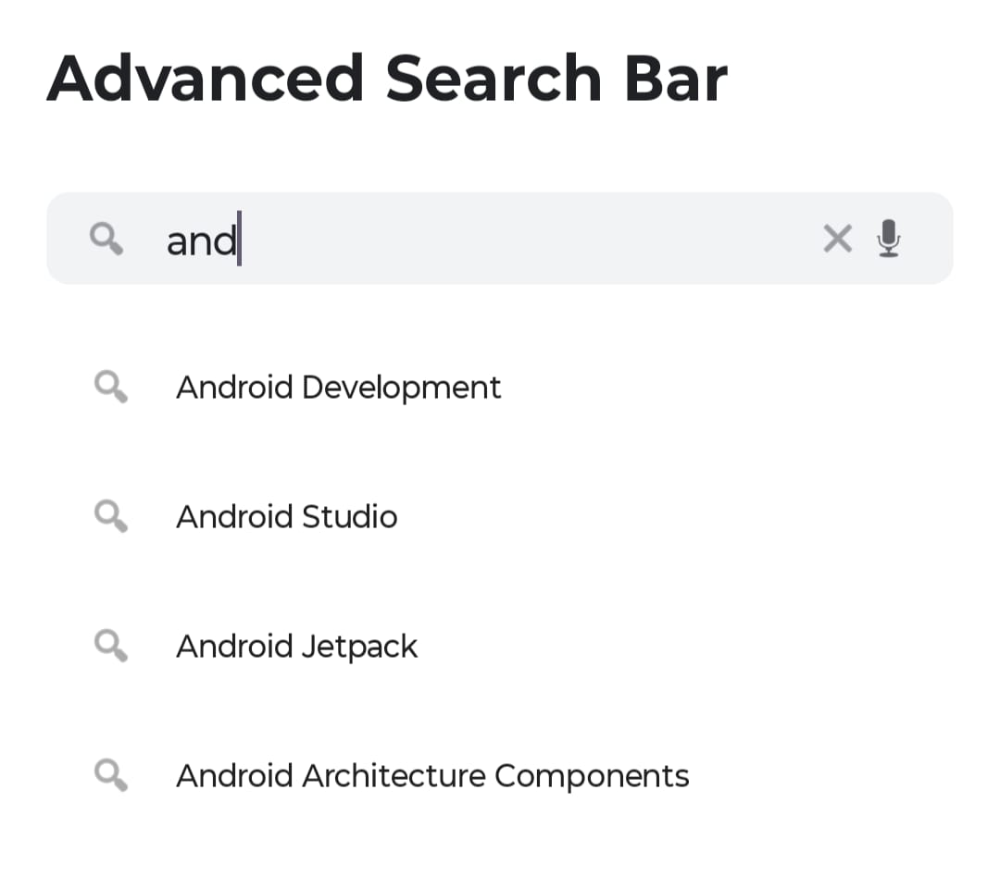
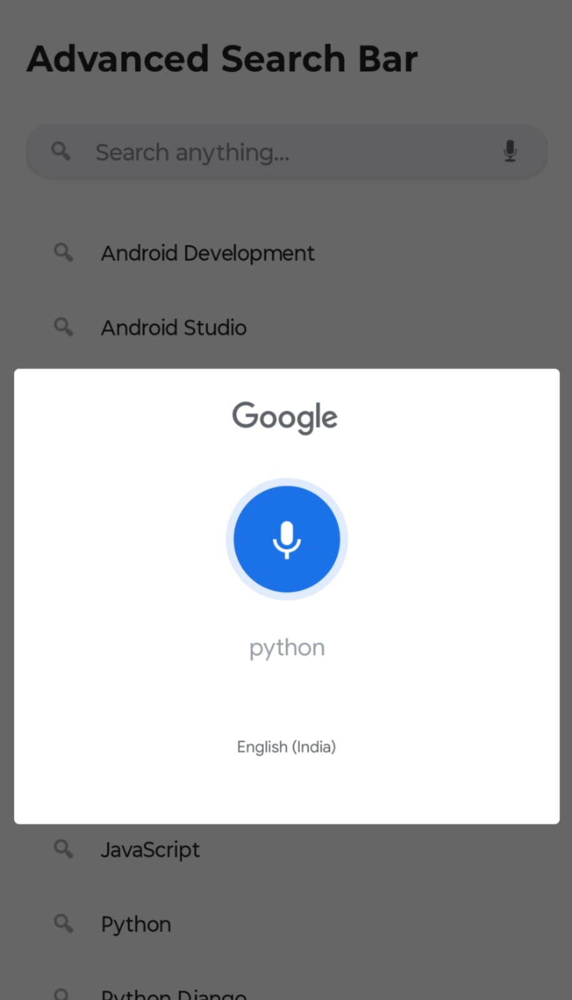
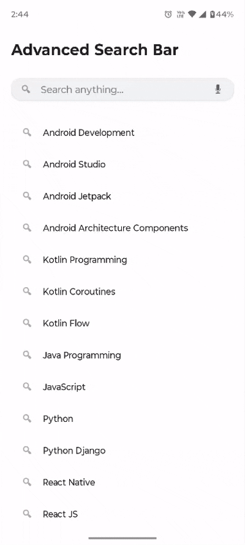

# Advanced Search Bar Library
[](https://kotlinlang.org/)
[](LICENSE)
[](#)

**Advanced Search Bar Library** is a powerful, highly customizable Android search bar with built-in **debounce**, **voice search**, **real-time suggestions**, and **Material Design 3** styling support. Perfect for apps needing a sleek, Google-like search experience.

---
## Preview

| Advanced Search Bar | Voice Search |
|------------|--------------|
|  |  |

<br/>

<div align="center">
  
</div>


---
## Features

- **Real-time Auto-Complete** – Shows all suggestions initially, filters as you type
- **Debounce Support** – Built-in configurable delay (prevents excessive filtering)
- **Voice Search** – Full speech recognition integration
- **Custom Icons** – Search, voice, and clear icons with independent visibility & sizing
- **Full Styling Control** – Background, corner radius, elevation, paddings, text styles
- **Material Design 3 Ready** – Pill-shaped, elevated, modern look
- **Runtime Customization** – Change everything programmatically
- **Lightweight & Clean** – Uses Kotlin Coroutines, no heavy dependencies
- **Separation of Concerns** – Library handles logic, you control the suggestions UI

---
## Installation

**Step 1:** Add JitPack repository to your root `build.gradle` or `settings.gradle`:

```gradle
allprojects {
    repositories {
        maven { url 'https://jitpack.io' }
    }
}
```

**Step 2:** Add the dependency:

```gradle
dependencies {
    implementation 'com.github.YourUsername:AdvancedSearchBar:1.0.0'

    // Required for RecyclerView & CardView
    implementation 'androidx.recyclerview:recyclerview:1.3.2'
    implementation 'androidx.cardview:cardview:1.0.0'
}
```

---
## Usage

### 1. Add to Layout (`activity_main.xml`)

```xml
<com.ext.advanced_searchbar.AdvancedSearchBar
    android:id="@+id/advancedSearchBar"
    android:layout_width="match_parent"
    android:layout_height="56dp"
    android:layout_marginHorizontal="24dp"
    android:layout_marginTop="32dp"
    app:searchBarBackgroundColor="#F1F3F4"
    app:searchBarCornerRadius="28dp"
    app:searchBarElevation="2dp"
    app:hintText="Search anything..."
    app:textSize="16sp"
    app:iconSize="24dp"
    app:iconTint="#5F6368"
    app:showSearchIcon="true"
    app:showVoiceIcon="true" />

<!-- Suggestions Dropdown -->
<androidx.cardview.widget.CardView
    android:id="@+id/suggestionsCard"
    android:layout_width="match_parent"
    android:layout_height="wrap_content"
    android:layout_marginHorizontal="24dp"
    android:layout_marginTop="8dp"
    app:cardCornerRadius="16dp"
    app:cardElevation="6dp"
    app:cardBackgroundColor="#FFFFFF">

    <androidx.recyclerview.widget.RecyclerView
        android:id="@+id/suggestionsRecyclerView"
        android:layout_width="match_parent"
        android:layout_height="wrap_content"
        android:padding="8dp"
        android:maxHeight="400dp" />
</androidx.cardview.widget.CardView>
```

### 2. Setup in Activity (`MainActivity.kt`)

```kotlin
class MainActivity : AppCompatActivity() {

    private lateinit var searchBar: AdvancedSearchBar
    private lateinit var suggestionsRecyclerView: RecyclerView
    private lateinit var adapter: SuggestionsAdapter

    private val voiceLauncher = registerForActivityResult(ActivityResultContracts.StartActivityForResult()) {
        searchBar.handleVoiceResult(it.resultCode, it.data)
    }

    override fun onCreate(savedInstanceState: Bundle?) {
        super.onCreate(savedInstanceState)
        setContentView(R.layout.activity_main)

        setupSearchBar()
        setupRecyclerView()

        // Show all suggestions on launch
        showAllSuggestions()
    }

    private fun setupSearchBar() {
        searchBar = findViewById(R.id.advancedSearchBar)

        val items = listOf("Android", "Kotlin", "Jetpack", "Flutter", "React Native", "Firebase", ...)

        searchBar.setSuggestions(items)
        searchBar.setVoiceSearchLauncher(voiceLauncher)

        searchBar.setOnSuggestionsFilteredListener { suggestions ->
            if (searchBar.getSearchText().isEmpty()) {
                showAllSuggestions()
            } else {
                updateSuggestions(suggestions)
            }
        }

        searchBar.setOnSearchListener { query ->
            Toast.makeText(this, "Searching: $query", Toast.LENGTH_SHORT).show()
            hideSuggestions()
        }
    }

    private fun updateSuggestions(list: List<String>) {
        adapter.updateSuggestions(list)
        findViewById<View>(R.id.suggestionsCard).visibility = if (list.isEmpty()) View.GONE else View.VISIBLE
    }

    private fun showAllSuggestions() = updateSuggestions(items)
    private fun hideSuggestions() { findViewById<View>(R.id.suggestionsCard).visibility = View.GONE }
}
```

### 3. Suggestion Item Layout (`item_suggestion.xml`)

```xml
<LinearLayout ...>
    <ImageView
        android:src="@android:drawable/ic_menu_search"
        android:tint="#757575" />
    <TextView
        android:id="@+id/suggestionText"
        android:layout_weight="1"
        android:textSize="16sp" />
</LinearLayout>
```

---
## XML Attributes

| Attribute                  | Type         | Default     | Description                       |
|---------------------------|--------------|-------------|-----------------------------------|
| `showSearchIcon`          | boolean      | true        | Show search icon                  |
| `showVoiceIcon`           | boolean      | true        | Show microphone icon             |
| `searchBarBackgroundColor`| color        | #FFFFFF     | Background color                  |
| `searchBarCornerRadius`   | dimension    | 24dp        | Corner radius                     |
| `searchBarElevation`      | dimension    | 4dp         | Shadow elevation                  |
| `searchBarPadding`        | dimension    | 16dp        | Inner padding                     |
| `hintText`                | string       | "Search..." | Placeholder text                  |
| `textColor` / `hintColor` | color        | black/gray  | Text and hint colors              |
| `textSize`                | dimension    | 16sp        | Text size                         |
| `iconTint`                | color        | #757575     | Icon color                        |
| `iconSize`                | dimension    | 48dp        | Size for all icons                |
| `searchIconSize` / `voiceIconSize` | dimension | —         | Individual icon sizes             |
| `debounceTime`            | integer      | 300         | Debounce delay in ms              |

---
## Programmatic Usage

```kotlin
searchBar.apply {
    setSearchBarBackgroundColor(Color.parseColor("#E8DEF8"))
    setSearchBarCornerRadius(32f)
    setSearchBarElevation(8f)
    setIconTint(Color.parseColor("#6750A4"))
    setTextSize(18f)
    setHintText("Find something...")
    setDebounceTime(500)
}
```

---
## Permissions (Voice Search)

Add to `AndroidManifest.xml`:
```xml
<uses-permission android:name="android.permission.RECORD_AUDIO" />
```

Request at runtime on Android 6.0+.

---
## Requirements

- Min SDK: **21**
- Kotlin: **1.9+**
- AndroidX
- Dependencies: RecyclerView, CardView

## 📄 License

```
MIT License

Copyright (c) 2025 Excelsior Technologies 

Permission is hereby granted, free of charge, to any person obtaining a copy
of this software and associated documentation files (the "Software"), to deal
in the Software without restriction, including without limitation the rights
to use, copy, modify, merge, publish, distribute, sublicense, and/or sell
copies of the Software, and to permit persons to whom the Software is
furnished to do so, subject to the following conditions:

The above copyright notice and this permission notice shall be included in all
copies or substantial portions of the Software.

THE SOFTWARE IS PROVIDED "AS IS", WITHOUT WARRANTY OF ANY KIND, EXPRESS OR
IMPLIED, INCLUDING BUT NOT LIMITED TO THE WARRANTIES OF MERCHANTABILITY,
FITNESS FOR A PARTICULAR PURPOSE AND NONINFRINGEMENT. IN NO EVENT SHALL THE
AUTHORS OR COPYRIGHT HOLDERS BE LIABLE FOR ANY CLAIM, DAMAGES OR OTHER
LIABILITY, WHETHER IN AN ACTION OF CONTRACT, TORT OR OTHERWISE, ARISING FROM,
OUT OF OR IN CONNECTION WITH THE SOFTWARE OR THE USE OR OTHER DEALINGS IN THE
SOFTWARE.
```
